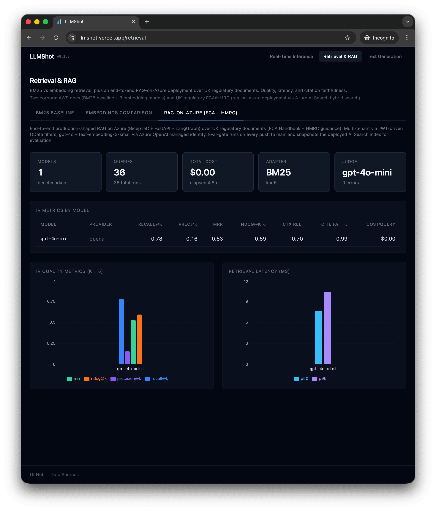
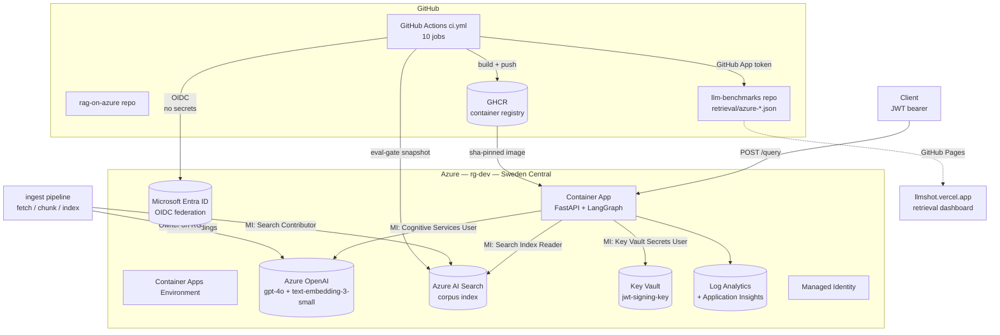
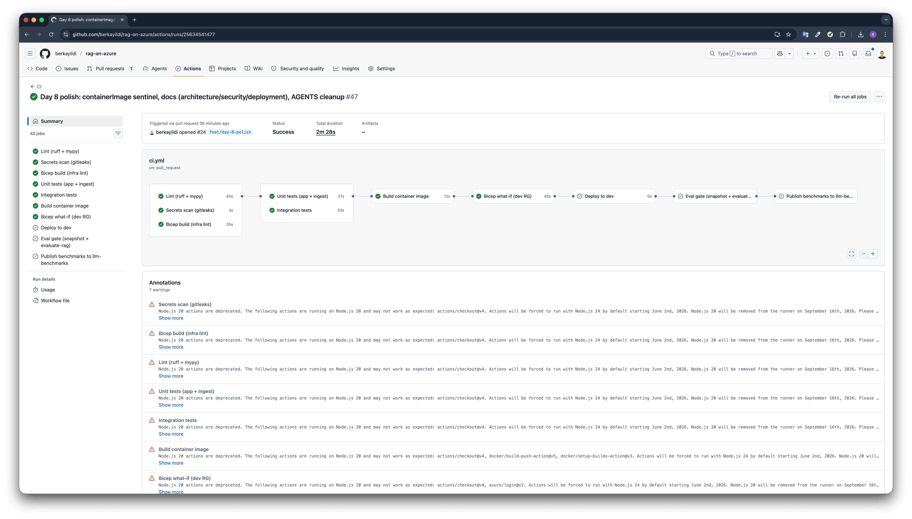

# rag-on-azure

A production-shaped Retrieval-Augmented Generation application on Microsoft Azure, built as a reference implementation of LLMOps discipline: Bicep IaC, FastAPI + LangGraph, multi-tenant via JWT-driven OData filters, and a quality gate (`mcp-llm-eval`) measured continuously on every push to `main`. Calibrated thresholds, eval results pushed to a public dashboard, no long-lived secrets in the deployed runtime. Intended for portfolio reviewers and LLMOps practitioners studying production patterns; forks are welcome as architectural reference.

## Live demo

The deployed dev stack runs at `https://rag-dev-ca.ashybay-7602179f.swedencentral.azurecontainerapps.io`. Auth-free probes are public; `/query` requires a JWT minted via [`scripts/mint-token.py`](scripts/mint-token.py).

**Quickest verification** — chains healthz → readyz → signed `/query` against the live stack:

```bash
make smoke
```

Or step-by-step:

```bash
FQDN="https://rag-dev-ca.ashybay-7602179f.swedencentral.azurecontainerapps.io"

# Liveness — auth-free
curl -s "$FQDN/healthz"
# {"status":"ok"}

# Readiness — auth-free, pings each runtime client
curl -s "$FQDN/readyz"
# {"status":"ready","checks":{"openai":"ok","search":"ok","key_vault":"ok"}}

# Prometheus exposition — auth-free, public per design (see docs/security.md)
curl -s "$FQDN/metrics" | head -20

# Real query — admin-or-tenant JWT required
TOKEN=$(python scripts/mint-token.py demo)
curl -s "$FQDN/query" \
  -H "Authorization: Bearer $TOKEN" \
  -H "Content-Type: application/json" \
  -d '{"question":"What does PS26/3 say about commission disclosure?","top_k":5}' \
  | jq .
```

The retrieval-domain dashboard at [llmshot.vercel.app/retrieval](https://llmshot.vercel.app/retrieval) renders the live eval-gate output as the **rag-on-azure (FCA + HMRC)** tile, refreshed on every push to `main`.



## Architecture



CI runs ten jobs on every push to `main`:



`lint` → `gitleaks` → `bicep-validate` → `unit-tests` → `integration-tests` → `build` → `bicep-whatif` → `deploy` → `eval-gate` → `publish-benchmarks`. OIDC-federated; no service principal secret in repo settings. Full topology in [`docs/architecture.md`](docs/architecture.md).

## Quick start

```bash
git clone git@github.com:berkayildi/rag-on-azure.git && cd rag-on-azure
az login                                            # tenant + sub the dev RG lives in
make plan                                           # az deployment group what-if; read-only
make apply                                          # azd provision; ~3 min for a fresh RG
cd ingest && python -m ingest all && cd ..          # seed the corpus into AI Search
make smoke                                          # verify end-to-end (healthz + readyz + signed /query)
```

That's the five-line summary. The real day-1 runbook (twelve steps including OIDC bootstrap, JWT key plumbing, eval-gate operator setup, and llm-benchmarks GitHub App provisioning) lives in [`docs/deployment.md`](docs/deployment.md).

## Tech stack

| Layer | Components |
|---|---|
| **Azure platform** | Container Apps (scale-to-zero), Azure AI Search (Free SKU, hybrid BM25 + HNSW vector), Azure OpenAI (`gpt-4o@2024-11-20` + `text-embedding-3-small`), Key Vault (RBAC), Log Analytics + Application Insights, system-assigned Managed Identity |
| **Application** | FastAPI 0.115+ (async-first), LangGraph 2.x (linear `understand → retrieve → generate`), Pydantic v2 models throughout, `prometheus-client` for `/metrics`, `pyjwt[crypto]` RS256 verification |
| **Infrastructure** | Bicep (modular, 6 modules), GitHub Actions (~350 lines, 10 jobs), OIDC federation to Microsoft Entra ID (no long-lived service principal secret), Release Please for versioning |
| **Observability** | `prometheus-client` `/metrics` endpoint with retrieval/generation/total histograms (LLM-tuned buckets, not HTTP defaults), Application Insights for traces and logs, structured logging with `run_id` correlation on `/ingest` |
| **Eval & quality** | [`mcp-llm-eval`](https://github.com/berkayildi/mcp-llm-eval) `==0.9.2` from PyPI; 36 grounded golden questions over UK regulatory documents (FCA Policy Statements + HMRC guidance); calibrated thresholds enforced on every push to `main`; results pushed to [llm-benchmarks](https://github.com/berkayildi/llm-benchmarks) and rendered on [llmshot.vercel.app](https://llmshot.vercel.app/retrieval) |
| **Security tooling** | `gitleaks` (pre-commit + CI step, version-pinned), Dependabot (github-actions + pip ecosystems), GitHub secret scanning + push protection, `mypy --strict` |

## Eval gate

The eval gate is the load-bearing quality contract. Every push to `main` snapshots the deployed dev AI Search index for a single tenant, runs `mcp-llm-eval evaluate-rag` against `eval/golden.jsonl` (36 questions grounded in real corpus chunks), and asserts retrieval and generation metrics against calibrated thresholds. Threshold misses fail the build; no main commit ships without eval evidence.

**Calibrated thresholds and a representative measurement set** (the latest passing main run is linked from the [Actions tab](https://github.com/berkayildi/rag-on-azure/actions); BM25 retrieval is deterministic against a fixed corpus, so retrieval metrics are stable run-over-run):

| Metric | Threshold | Current |
|---|---|---|
| `avg_recall_at_k` | ≥ 0.60 | **0.7778** |
| `avg_mrr` | ≥ 0.50 | **0.5278** |
| `avg_ndcg_at_k` | ≥ 0.55 | **0.5908** |
| `avg_context_relevance` (LLM judge) | ≥ 0.55 | **0.7028** |
| `avg_citation_faithfulness` (LLM judge) | ≥ 0.90 | **0.9931** |
| `p95_retrieval_latency_ms` | ≤ 200 | **8.6** |
| `p95_ttft_ms` | ≤ 5000 | **0** |
| `max_cost_per_query` | ≤ £0.005 | **£0.0000** |

**Stability proof**: 16 dependabot dependency upgrades through Day 7 (including `azure-search-documents` 11→12, `openai` 1→3, `langgraph` 0.2→2) plus 5 phase merges (`/metrics`, `publish-benchmarks`, `/ingest`, calibration, polish) introduced **zero retrieval-metric drift** (BM25 against an unchanged corpus is deterministic) and **<1% drift** on the LLM-judge metrics — well inside judge variance. The full calibration history sits in `eval/.eval-gate.yml`.

The threshold *floor* is conservative on purpose. The metrics live above it because the corpus is well-shaped and the questions are grounded; tightening lands as a separate calibration commit when there's run-over-run signal that justifies it.

## Project structure

```
rag-on-azure/
├── .github/workflows/ci.yml      # 10-job pipeline including eval-gate + publish-benchmarks
├── infra/                        # Bicep (main + 6 modules: search, openai, containerapp, keyvault, monitor)
├── app/                          # FastAPI + LangGraph; production code path
│   ├── src/rag_on_azure/         # api/, nodes/, clients/, metrics, settings, auth, key_vault
│   └── tests/                    # unit + integration; 168 tests pass
├── ingest/                       # corpus pipeline (fetch + chunk + index); idempotent content-hash sweep
│   ├── src/ingest/               # CLI + 4 modules
│   └── corpus_manifest.yaml      # 9 sources: FCA Policy Statements / Consultations / Finalised Guidance + HMRC guidance
├── eval/                         # golden.jsonl (36 rows) + .eval-gate.yml (thresholds) + snapshot_corpus.py
├── scripts/                      # bootstrap-oidc.sh, mint-token.py, seed-corpus.sh
└── docs/
    ├── architecture.md           # onboarding-grade reference (Mermaid + components)
    ├── deployment.md             # day-1 runbook (12 steps)
    ├── security.md               # threat model + secret inventory + per-route auth posture
    ├── design/rag-on-azure.md    # full design spec, single source of truth
    └── assets/                   # screenshots
```

## Documentation

- [`docs/architecture.md`](docs/architecture.md) — request-flow diagram, component boundaries, audit-grade invariants
- [`docs/deployment.md`](docs/deployment.md) — clean-checkout to first green CI in twelve steps
- [`docs/security.md`](docs/security.md) — threat model, secret inventory, per-route auth posture, hardening upgrades
- [`docs/design/rag-on-azure.md`](docs/design/rag-on-azure.md) — full design spec (canonical source of truth, ~600 lines)
- [`AGENTS.md`](AGENTS.md) — operational quirks (the things that cost 10+ minutes the first time) plus working notes for AI agents (Claude Code) that contribute to this repo

## API surface

- `POST /query` — admin-or-tenant JWT, the only route that touches the LangGraph
- `GET /healthz` — auth-free liveness probe
- `GET /readyz` — auth-free readiness probe; pings each runtime client
- `GET /metrics` — auth-free Prometheus exposition (counters + LLM-tuned histograms + standard process collectors)
- `POST /ingest` — admin-only (`tenant_admin` JWT claim); schedules the corpus pipeline as a background task and returns 202 + `run_id`

Full route specifications including auth posture and metric definitions in [`docs/design/rag-on-azure.md`](docs/design/rag-on-azure.md) §3.4.

## Benchmark publication

Every CI run on `main` whose `eval-gate` passes pushes the resulting summary and per-query benchmark JSONs to the [`llm-benchmarks`](https://github.com/berkayildi/llm-benchmarks) repo: latest pointers under `retrieval/azure-{summary,benchmark}.json` for current-state views, plus a timestamped pair under `retrieval/history/` for drift charts. Mechanism is a GitHub App install token (`actions/create-github-app-token@v1`); the job is best-effort (`continue-on-error: true`) and gated on `vars.LLMSHOT_PUSH_ENABLED == 'true'` so forks unconnected to the llmshot ecosystem skip it silently. Full details in [`docs/design/rag-on-azure.md`](docs/design/rag-on-azure.md) §13.

## Roadmap

Items deferred from v1 and tracked for a future v0.x release:

- **Azure Pipelines mirror.** The original v1 spec called for an `azure-pipelines.yml` mirror of the GitHub Actions pipeline (target audience: Azure DevOps shops). Deferred because GitHub Actions is now the canonical CI (10 jobs, OIDC, eval-gate, cross-repo App-token publish) and a partial mirror would be worse than none. Full rationale in [`docs/design/rag-on-azure.md`](docs/design/rag-on-azure.md) §6.2.
- **Two-app-registration split for CI federated identity.** Today, one AAD app holds both `:ref:refs/heads/main` and `:pull_request` federated credentials. Branch protection is the load-bearing control. Production posture splits into a PR-scoped Reader app and a main-scoped Owner app. See [`docs/security.md`](docs/security.md).
- **Multi-chunk goldens + `avg_precision_at_k` re-add.** The current 36 golden rows each have exactly one `relevant_chunk_ids` entry, which mathematically caps `avg_precision_at_5` at 1/5 — uninformative. The metric was removed during calibration and lands back when the dataset grows multi-chunk relevance.
- **Multi-tenant scaling.** `queries_total` is labelled by `tenant_id`. Cardinality grows linearly with tenant count; demo has one. Documented to revisit at >100 tenants.
- **`GET /ingest/{run_id}`** status endpoint for the admin pipeline. Run IDs flow into structured logs today; a polling endpoint adds operational ergonomics for long-running ingests.
- **Container Apps Job for `/ingest`.** Scheduling the corpus pipeline as a FastAPI `BackgroundTasks` callback works for the demo but is susceptible to scale-to-zero kill mid-run (idempotent retry recovers, but a Job is the prod-grade move).

## Licence

Released under the [MIT Licence](LICENSE).
