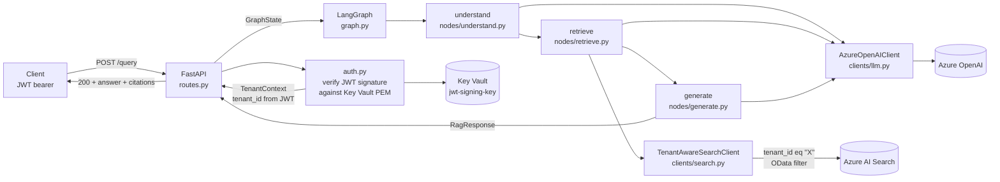

# Architecture

Onboarding-grade reference for `rag-on-azure`. Pulls together the spec
sections you need on day one. The canonical source of truth is
[`docs/design/rag-on-azure.md`](design/rag-on-azure.md); this document
exists so you don't have to read all 600 lines of the spec to find your
bearings.

## What it is

A multi-tenant Retrieval-Augmented Generation app on Azure. JWT-bearing
clients POST a question to `/query`; the app retrieves citation-grade
chunks from a tenant-filtered Azure AI Search index and asks Azure
OpenAI to answer using only those chunks. Every cited chunk ID is
validated against the retrieved set before the answer is returned —
hallucinated citations turn into HTTP 502, never silent passes.

## Request flow

The graph is linear: `understand → retrieve → generate → END`. State is
a Pydantic `GraphState`; `tenant_id` is set once at the API boundary
from the verified JWT and flows immutably through every node.

## Components

### FastAPI surface (`app/src/rag_on_azure/api/routes.py`)

Five routes:

- `POST /query` — admin-or-tenant JWT, the only route that touches the
  graph.
- `GET /healthz` — auth-free liveness; returns 200 unconditionally.
  Container Apps liveness probe target.
- `GET /readyz` — auth-free readiness; pings each runtime client (LLM,
  Search, Key Vault) once with a 2 s timeout each. Returns 503 if any
  ping fails. Container Apps readiness probe target.
- `GET /metrics` — auth-free Prometheus exposition. Application
  counters (`queries_total`, `retrieval_errors_total`,
  `generation_errors_total`, `ingest_runs_total`), histograms
  (`retrieval_latency_seconds`, `generation_latency_seconds`,
  `total_request_seconds`, `ingest_duration_seconds`,
  `ingest_chunks_indexed_total`), and the standard
  `process_*`/`python_*`/`python_gc_*` collectors auto-registered by
  `prometheus_client`. Public posture per design pause D1; production
  upgrade documented in `docs/security.md`.
- `POST /ingest` — admin-only (`tenant_admin` JWT claim). Schedules
  the corpus pipeline as a FastAPI `BackgroundTasks` callback and
  returns 202 with a UUID4 `run_id`. Module-level `asyncio.Lock`
  prevents concurrent runs on the same replica; conflict returns 409.

### LangGraph nodes (`app/src/rag_on_azure/nodes/`)

- `understand` — calls the LLM to rewrite the question for retrieval
  (expand acronyms, extract year/jurisdiction filters). Populates
  `state.rewritten_query` and `state.filters`.
- `retrieve` — embeds the rewritten query, calls
  `TenantAwareSearchClient.hybrid_search` (BM25 + vector, RRF-fused
  by Azure). Populates `state.retrieved_chunks`.
- `generate` — calls the LLM with a structured-output schema
  (`Answer { text, cited_chunk_ids }`) and validates that every cited
  ID exists in `state.retrieved_chunks`. Hallucinated IDs trigger one
  retry with a stricter prompt; a second violation raises
  `CitationContractError` and the API layer maps that to HTTP 502.
  Empty-retrieval short-circuit: if no chunks come back, the node
  returns `EMPTY_RETRIEVAL_ANSWER` directly without calling the LLM
  (mirrors the retrieval-boundary guarantee at the generation
  boundary).

### Adapters (`app/src/rag_on_azure/clients/`)

- `LLMClient` is a `Protocol`. `AzureOpenAIClient` is the production
  implementation; uses `DefaultAzureCredential` (managed identity in
  Container Apps, `az login` locally) — no API keys.
- `TenantAwareSearchClient` is the multi-tenant retrieval boundary.
  `hybrid_search()` requires `tenant_id` as a positional-or-keyword
  argument (never optional); calling without it is a `TypeError` at
  runtime *and* a `mypy --strict` error at type-check time. The OData
  filter is composed inside the client with single-quote doubling and
  a strict `^[a-z0-9-]+$` validator on the tenant_id value. The only
  named admin escape hatch is `list_existing_hashes()`, used by ingest
  for idempotent re-indexing — flagged ingest-only in its docstring.

### Lifespan (`app/src/rag_on_azure/main.py`)

The FastAPI lifespan constructs the canonical clients exactly once at
process start and closes them on shutdown. The compiled LangGraph is
built once from those clients and attached to `app.state.graph`; route
handlers pull it via `Depends(get_graph)`. Each client owns its own
`DefaultAzureCredential` — sharing one between two clients works at
runtime but doubles the close-on-shutdown contract for no real saving
since credentials are cheap to mint.

Key Vault is pinged at boot and the lifespan raises if the ping
fails — Container Apps then restarts the replica rather than letting
a half-broken instance accept traffic. The JWT verifier (Day 6) reads
the public PEM via the `KeyVaultClient`, so an unreachable vault
means no token verifies.

### Ingest pipeline (`ingest/src/ingest/`)

Three phases, idempotent end-to-end via content-hashing:

- `fetch.py` — pull declared sources from `corpus_manifest.yaml`,
  HTML-to-Markdown via `markdownify` or page-by-page PDF via `pypdf`.
  Re-runs skip files whose SHA-256 hasn't changed since the last
  fetch.
- `chunk.py` — split fetched markdown into chunks. Markdown-aware
  splitter from `langchain-text-splitters`: 800 tokens, 100 overlap,
  headings preserved as `section_path` metadata.
- `index.py` — embed and upload to Azure AI Search. Per-chunk
  `content_hash` recorded in the index; re-runs pull existing hashes
  in one paged sweep and only embed/upload chunks whose hash changed.

Two invocation paths share this pipeline (design spec §4.5):
operator-side `make ingest` → `python -m ingest all`, and the
admin-gated `POST /ingest` route. Same code, same idempotency.

## Audit-grade invariants

Two invariants are explicitly tested as load-bearing assertions of the
multi-tenant security model (design spec §5.3):

- **Cross-tenant retrieval cannot occur.** The `tenant_id` argument to
  `TenantAwareSearchClient.hybrid_search` is non-optional at both
  runtime and type-check time, and the OData filter
  `tenant_id eq '<id>'` is always the first AND-clause. Tested in
  `app/tests/unit/test_search.py::test_cross_tenant_leak_prevented`.
- **Calling `hybrid_search` without a tenant_id raises.** Tested in
  `app/tests/unit/test_search.py::test_missing_tenant_id_raises`.

These tests are the demo's whole multi-tenant credibility claim.
Touching them requires explicit acknowledgment in the PR description.

## Authentication flow (`app/src/rag_on_azure/auth.py`)

- JWT signed with the RS256 key whose public PEM lives in Key Vault
  (`jwt-signing-key` secret). Required claims: `sub`, `tenant_id`,
  `exp`, `iat`. Optional: `tenant_admin` (boolean; gates
  `POST /ingest`).
- `auth.py` fetches the public PEM via `KeyVaultClient` (cached for
  5 minutes), verifies the signature, extracts `tenant_id` into a
  `TenantContext` model, and attaches it to the request via
  dependency injection. `tenant_id` flows from `TenantContext` into
  `GraphState`; **no path exists** where `tenant_id` comes from the
  request body or query string.
- An `ENABLE_DEV_AUTH=true` kill-switch (Day 5 vintage; documented
  for removal in a future hardening pass) bypasses signature
  verification but still requires the `tenant_id` claim. Logged
  loudly at boot. Off by default; the production posture is
  signature-on.

## Storage and state

- **Azure AI Search** holds the corpus (`corpus` index). Field set:
  `id` (key), `tenant_id` (filterable, facetable), `source`,
  `section_path`, `chunk_text`, `chunk_vector` (1536-dim, HNSW),
  `content_hash`. Schema lives in
  `ingest/src/ingest/schema.py`.
- **Key Vault** holds the JWT signing key (`jwt-signing-key`,
  RSA-2048 PEM). Operator-managed: Bicep declares the secret
  metadata only — its value is set out-of-band and is never
  overwritten on subsequent deploys (closes a regression where every
  apply was rotating the key; see `AGENTS.md`).
- **Log Analytics + Application Insights** capture stdout/stderr from
  the Container App and trace data emitted by FastAPI/uvicorn.
- **GHCR** stores the container image. Every CI build pushes both an
  immutable `sha-<short>` tag and a mutable `latest-dev` tag; deploys
  pin to the sha tag.

## CI/CD and quality gating

Two workflows fire on push to main: `ci.yml` and `release-please.yml`.

`ci.yml` runs ten jobs:

1. `lint` (ruff + mypy --strict)
2. `gitleaks` (secrets scan)
3. `bicep-validate` (compile every .bicep)
4. `unit-tests` (app + ingest)
5. `integration-tests` (FastAPI TestClient + fakes)
6. `build` (Docker buildx, push GHCR)
7. `bicep-whatif` (against the dev RG, OIDC)
8. `deploy` (main only)
9. `eval-gate` (snapshot dev AI Search index → run mcp-llm-eval against
   golden.jsonl → enforce calibrated thresholds)
10. `publish-benchmarks` (push eval results to `llm-benchmarks` repo
    via GitHub App install token; gated on
    `vars.LLMSHOT_PUSH_ENABLED == 'true'`)

The eval-gate is the load-bearing quality contract: every push to
main runs 36 grounded golden-dataset queries against the deployed
dev RAG and asserts retrieval and generation metrics against
calibrated thresholds. Threshold details and calibration history in
`eval/.eval-gate.yml`.

## Where to look next

- Design spec, full: [`docs/design/rag-on-azure.md`](design/rag-on-azure.md)
- Day-1 deployment runbook: [`docs/deployment.md`](deployment.md)
- Threat model + secret inventory: [`docs/security.md`](security.md)
- Operational quirks (the things that cost 10+ minutes the first
  time): [`AGENTS.md`](../AGENTS.md) `## Operational quirks`
